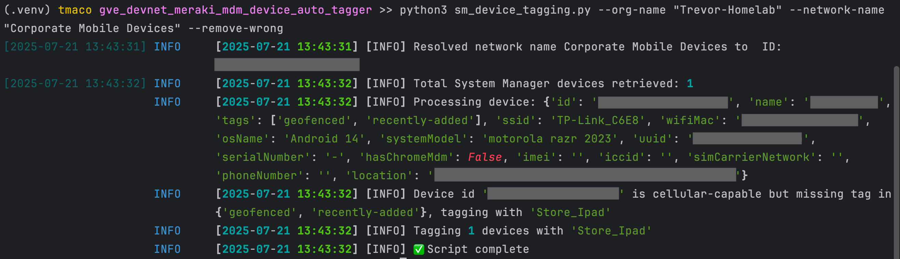
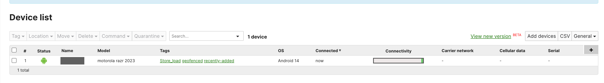

# 📱 Meraki Cellular vs WiFi-only Auto-Tagger

Automatically tag Meraki System Manager (SM) devices based on cellular capabilities using the Meraki Dashboard API.

## Features

- Detects if a device has cellular capability (IMEI, ICCID, SIM carrier, phone number)
- Tags devices with customizable **cellular** or **Wi-Fi only** tags
- Optionally removes incorrect or outdated tags
- Supports chunked API calls to meet Meraki limits
- Outputs readable logs to both console and file (`auto_tag.log`)

## How It Works

For each SM device in the specified network:
- If any cellular identifiers are present, it is tagged with the **cellular tag**
- If not, it is tagged with the **Wi-Fi-only tag**
- If `--remove-wrong` is set, it will also remove any incorrect tags

## Requirements

- Python 3.7+
- `meraki`, `python-dotenv`, and `rich` packages

Install dependencies:

```bash
pip install -r requirements.txt
```

## Setup

1. Create a `.env` file in the same folder as the script:

```
MERAKI_DASHBOARD_API_KEY=your_api_key_here
```

## Usage

```bash
python sm_device_tagging.py \
  --org-name "My Organization" \
  --network-name "My SM Network" \
  --cellular-tag "Store_iPad" \
  --wifi-tag "Curbside_iPad" \
  --remove-wrong
```

### Arguments

| Argument          | Description                                                  |
|-------------------|--------------------------------------------------------------|
| `--org-name`       | Meraki organization name                                     |
| `--network-name`   | Name of the SM network to tag devices in                     |
| `--cellular-tag`   | (Optional) Tag for cellular-capable devices (default: `Store_iPad`)   |
| `--wifi-tag`       | (Optional) Tag for Wi-Fi-only devices (default: `Curbside_iPad`)      |
| `--remove-wrong`   | (Optional) If set, removes incorrect tags                    |

## Output

- Logs actions to the console using Rich formatting
- Saves detailed log file as `auto_tag.log`
- Prints final summary including how many devices were tagged or untagged



